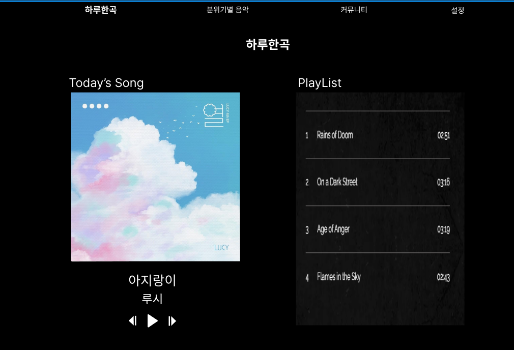

# 하루한곡

1. 프로젝트 소개
2. 주요 기능 시나리오
3. 특징

---

## 프로젝트 소개

- 한 줄 소개
    
    다양한 음악 장르를 좋아하는 이들을 위한 하루 한곡 노래 웹사이트
    
- 배경
    
     최근 음악 스트리밍 플랫폼이 사용자의 과거 듣기 기록과 유사한 음악을 추천하고 이로 인해 사용자들이 종종 자신의 음악 취향으로 한정되어 버리는 상황은 누구에게나 겪는 흔한 상황 중 하나입니다.  이러한 상황을 "필터 버블"이라고 합니다. 필터 버블은 알고리즘의 추천 정보만 접한 사용자가 관심이 없거나 본인의 의견과 다른 콘텐츠를 보지 못한 채 정보의 한정된 영역에 갇힐 수 있는 상황을 의미합니다.
  그렇기 때문에 원하는 장르에만 국한되지 않고, 다양한 형태와 스타일의 음악을 알아가고 싶다는 사람들의 생각은 점점 커지고 있습니다. 음악은 감정과 상호작용을 하며 색다른 경험을 제공할 수 있는 도구이고, 적은 시간을 투자하여 많은 감정들을 느낄 수 있을 뿐만 아니라 쉽게 해소하지 못하는 감정들을 풀어낼 수 있게 합니다. 
 이러한 면에서 지금까지의 경험이나 지식과 다른, 더욱 풍부한 경험을 음악으로 찾고자 웹사이트를 기획하게 되었습니다.

---

## 주요 기능

- 개요
    
    | 기준 | 내용 |
    | --- | --- |
    | 누가 | 다양한 음악 장르를 좋아하거나 새로운 음악을 듣고 싶은 사람들 |
    | 언제 | 다양한 장르의 음악을 듣고 싶을 때 |
    | 무엇을 | 다채로운 음악의 장르를 좋아하는 사람들을 위한 추천 |
    | 어떻게 | 하루에 한 곡 색다른 노래를 제공함 |
    | 왜 | 새로운 음악을 경험하고 음악 취향을 확장시키도록 도움 |

- 주요 기능
  - 다양한 장르와 아티스트를 접할 기회를 얻음으로써 자신만의 음악 취향을 넓혀갈 수 있다.
  - 매일 색다른 기분을 느낄 수 있는 기회를 제공할 수 있다.

---

## 특징

- 메인화면 page : 
하루한곡 웹사이트에 대한 전반적인 이미지를 보여줄 수 있습니다.

- 하루한곡 page :
 - 하루한곡 :
	- 하루마다 하나씩 다양한 장르와 년도의 음악을 추천할 수 있습니다. 
 - playlist :
	- 하루한곡에서 추천한 곡들을 모아 playlist를 만들어 보여줍니다.

- 음악 카테고리 page: 웹사이트에 저장된 음악을 한번에 볼 수 있는 페이지입니다.
 1. 다양한 가수 (다양한 나라의 가수, 버추얼 아이돌 등)
 2. 연도별 추천 (70년대, 80년대, … 00년대, 20년대 등)
 3. 새로운 아티스트와 음악 (대중적으로 잘 알려지지 않은 아티스트의 음악) 

- 커뮤니티 : 
	- 사용자들이 좋아하는 음악을 공유할 수 있습니다.
